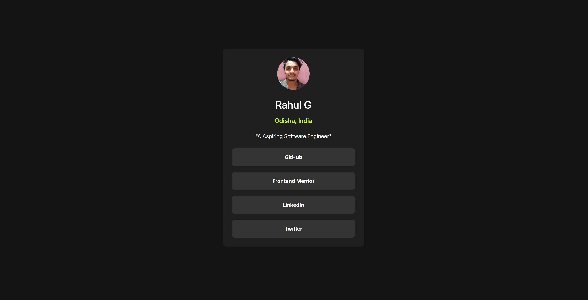

# Frontend Mentor - Social links profile solution

This is a solution to the [Social links profile challenge on Frontend Mentor](https://www.frontendmentor.io/challenges/social-links-profile-UG32l9m6dQ). Frontend Mentor challenges help you improve your coding skills by building realistic projects. 

## Table of contents

- [Overview](#overview)
  - [The challenge](#the-challenge)
  - [Screenshot](#screenshot)
  - [Links](#links)
- [My process](#my-process)
  - [Built with](#built-with)
  - [What I learned](#what-i-learned)
  - [Continued development](#continued-development)
  - [Useful resources](#useful-resources)
- [Author](#author)


## Overview

### The challenge

Users should be able to:

- See hover and focus states for all interactive elements on the page
- Navigate the links using keyboard tab key

### Screenshot




### Links

- Solution URL: [GitHub](https://github.com/Rahulg8270/Social-profile-links)
- Live Site URL: [Vercel](https://social-profile-links-nu.vercel.app/)

## My process

### Built with

- Semantic HTML5 markup
- Flexbox
- Mobile-first workflow


### What I learned

Use this mini project I learned about keyboard navigation and implemented it to the links

To see how you can add code snippets, see below:

```html
    <section class="links">
        <a href="https://github.com/Rahulg8270" target="_blank" tabindex="0">GitHub</a>
        <a href="https://www.frontendmentor.io/profile/Rahulg8270" target="_blank" tabindex="0">Frontend Mentor</a>
        <a href="https://www.linkedin.com/in/rahulganta/" target="_blank" tabindex="0">LinkedIn</a>
        <a href="https://x.com/Rahulg66919" target="_blank" tabindex="0">Twitter</a>
    </section>
```


### Continued development

I want to learn about CUBE CSS, Custom properties and variables and implement to this project.


### Useful resources

- [WebAIM Accessibility ](https://webaim.org/techniques/keyboard/) - This helped me to learn about keyboard navigation using tabIndex attribute.


## Author

- Website - [Rahul G](https://www.your-site.com)
- Frontend Mentor - [@Rahulg8270](https://www.frontendmentor.io/profile/Rahulg8270)
- LinkedIn - [/rahulganta](https://www.linkedin.com/in/rahulganta/)


